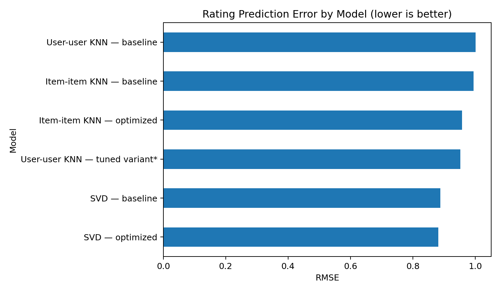
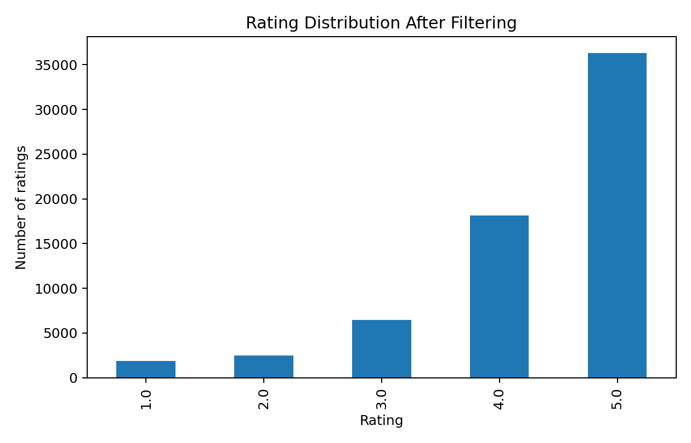

# Personalized Product Recommendation System

**E-commerce recommendation case study using 7.8M Amazon Electronics ratings**

This project compares popularity-based ranking, user-user collaborative filtering, item-item collaborative filtering, and matrix factorization for personalized product recommendations. It began as an elective recommendation-systems project and was rebuilt as a recruiter-facing case study with clearer model comparison, explicit limitations, and business-oriented deployment recommendations.

## Executive summary

The raw dataset contains **7,824,482 ratings from 4,201,696 users across 476,002 products**. To make neighborhood-based modeling tractable, the original project retained users with at least 50 ratings and products with at least 5 ratings, producing **65,290 interactions, 1,540 users, and 5,689 products**. Even after filtering, the user-item matrix is **99.25% sparse**.

Across the submitted models, **optimized SVD matrix factorization produced the lowest RMSE (0.8822)** while maintaining strong ranking metrics (**Precision@10 0.854, Recall@10 0.884, F1@10 0.869**). Similarity-based approaches performed competitively but sometimes could not find enough neighbors, exposing an important reliability issue in sparse recommendation settings.

**Recommended product strategy:** use popularity-based recommendations as a cold-start fallback, matrix factorization for users with sufficient history, and retain item-item similarity as an explainable complement for “similar products” experiences. Validate the final routing strategy online with A/B tests tied to click-through rate, conversion, revenue per session, and recommendation coverage.



## Business problem

An e-commerce marketplace needs to surface relevant products from a very large catalog without overwhelming customers. The modeling goal is to use historical explicit ratings to estimate user preferences and generate useful product recommendations while handling sparse interaction data and users with limited history.

This repository is a **case study using an Amazon Electronics ratings dataset**. It does not represent Amazon's production recommendation system.

## Data

| Stage | Ratings | Users | Products |
|---|---:|---:|---:|
| Raw data | 7,824,482 | 4,201,696 | 476,002 |
| Modeling subset | 65,290 | 1,540 | 5,689 |

Filtering was used because the original dataset is extremely sparse and computationally expensive for neighborhood models. This improves overlap among users and items, but it also **biases evaluation toward highly active users and better-known products**. Results therefore should not be interpreted as performance for the full marketplace population.

The repository includes only a small sample in `data/sample_ratings.csv`; the original 318 MB dataset is intentionally excluded from version control.



The filtered ratings have a mean of **4.29** and median of **5**, with ratings concentrated at the high end of the 1–5 scale. This positive skew makes a naïve “predict high” strategy deceptively competitive and is one reason ranking metrics are considered alongside RMSE.

## Modeling approach

The project evaluates four recommendation strategies:

1. **Popularity baseline** — recommends highly rated products subject to a minimum interaction threshold. Useful when personalization history is unavailable.
2. **User-user collaborative filtering** — estimates preferences from similar users.
3. **Item-item collaborative filtering** — estimates preferences from similarity among products a user has rated.
4. **SVD matrix factorization** — learns latent user and item factors to predict unseen ratings without requiring explicit nearest-neighbor overlap at prediction time.

For personalized models, the original project used an 80/20 train-test split and evaluated **RMSE, Precision@10, Recall@10, and F1@10**, with ratings ≥3.5 treated as relevant.

## Results

| Model | RMSE ↓ | Precision@10 ↑ | Recall@10 ↑ | F1@10 ↑ |
|---|---:|---:|---:|---:|
| User-user KNN — baseline | 1.0012 | 0.855 | 0.858 | 0.856 |
| User-user KNN — tuned variant* | 0.9526 | 0.847 | **0.894** | **0.870** |
| Item-item KNN — baseline | 0.9950 | 0.838 | 0.845 | 0.841 |
| Item-item KNN — optimized | 0.9576 | 0.839 | 0.880 | 0.859 |
| SVD — baseline | 0.8882 | 0.853 | 0.880 | 0.866 |
| **SVD — optimized** | **0.8822** | **0.854** | 0.884 | 0.869 |

\* During the portfolio audit, I found that the original user-user grid search selected **MSD similarity**, but the subsequent “optimized” model was instantiated with **cosine similarity**. The table therefore labels the reported result a *tuned variant* rather than claiming it is the exact grid-search winner. The cleaned notebook corrects the configuration for future reruns and documents the discrepancy rather than obscuring it.

### What the results mean

**SVD is the strongest overall choice for rating prediction.** It reduced RMSE by about **11.9% versus baseline user-user KNN** and avoided the hard neighbor-availability dependency seen in KNN examples. Its F1@10 is essentially tied with the best reported value, so the gain in rating accuracy did not require a meaningful loss in recommendation relevance.

**Recall and precision create a product tradeoff.** The tuned user-user variant achieved the highest Recall@10 (0.894) but slightly lower Precision@10 (0.847). In a recommendation surface with limited slots, precision may matter more; in discovery-oriented surfaces, recall can be valuable.

**Sparse-neighborhood failures matter operationally.** In the original notebook, optimized KNN predictions sometimes fell back to a global estimate because there were not enough neighbors. A production system should detect this condition and route the request to a fallback rather than treating all KNN scores as equally reliable.

## Business recommendations

**Use a routed/hybrid strategy rather than a single recommender.** For completely new or very low-history users, show popularity-based recommendations and progressively personalize as interactions accumulate. For users with sufficient history, use matrix factorization as the primary personalized ranker. Item-item similarity can support “similar products” modules because its logic is intuitive and can be easier to explain to users and merchandising teams.

**Do not select a production model from RMSE alone.** Offline rating prediction is only a proxy for business impact. Before deployment, compare candidate strategies in an A/B test using click-through rate, add-to-cart rate, conversion rate, revenue per session, and repeat engagement. Also monitor recommendation coverage so the system does not repeatedly concentrate exposure on a small set of already-popular products.

**Segment performance by user history.** The modeling subset intentionally excludes low-activity users, so aggregate offline metrics likely overstate performance for sparse-history customers. Evaluate cold, warm, and highly active users separately before launch.

**Add catalog and context features when available.** This dataset contains only IDs and ratings. Product category, price, brand, text/image embeddings, recency, availability, and session context could support hybrid models and materially improve cold-start handling.

## Technical audit and improvements

The portfolio rebuild preserved the original modeling work but corrected or documented issues that would matter in a code review:

- Replaced course-assignment framing with a realistic e-commerce case-study framing.
- Made the filtering bias and matrix sparsity explicit.
- Centralized model results into a comparison table rather than scattering them across notebook cells.
- Identified the **MSD-vs-cosine mismatch** in the user-user tuned model.
- Corrected an optimized-SVD example where product ID `1400501466` was accidentally typed as `140050146`.
- Removed Google Drive mounting and Colab-only setup from the portfolio notebook.
- Reframed single rating predictions as illustrative diagnostics rather than evidence that a recommender is globally good.
- Expanded the conclusion from “SVD wins” into an actionable deployment and experimentation strategy.

## Repository structure

```text
product-recommendation-system/
├── README.md
├── requirements.txt
├── .gitignore
├── data/
│   ├── README.md
│   └── sample_ratings.csv
├── notebooks/
│   └── recommendation_system_portfolio.ipynb
├── reports/
│   ├── model_results_from_submission.csv
│   └── figures/
│       ├── model_rmse.png
│       └── rating_distribution.png
└── src/
    └── recommender_utils.py
```

## Reproducibility note

The original personalized models were built with `scikit-surprise`. The current notebook retains the corrected Surprise modeling workflow. The numerical model table above is taken from the executed course submission; because the package is not available in this build environment, I do not present newly rerun KNN/SVD numbers as if they had been independently reproduced here. Data preparation and EDA have been independently reproduced from the supplied raw CSV.

## Next steps

The most valuable extension would be a **true top-N evaluation protocol** that ranks a candidate set of unseen products per user and reports metrics such as NDCG@K, Hit Rate@K, catalog coverage, and performance by interaction-history segment. A time-aware holdout would also better approximate real deployment than a random interaction split.

## Tools

Python, pandas, NumPy, matplotlib, scikit-learn, scikit-surprise, collaborative filtering, matrix factorization, recommender-system evaluation.
